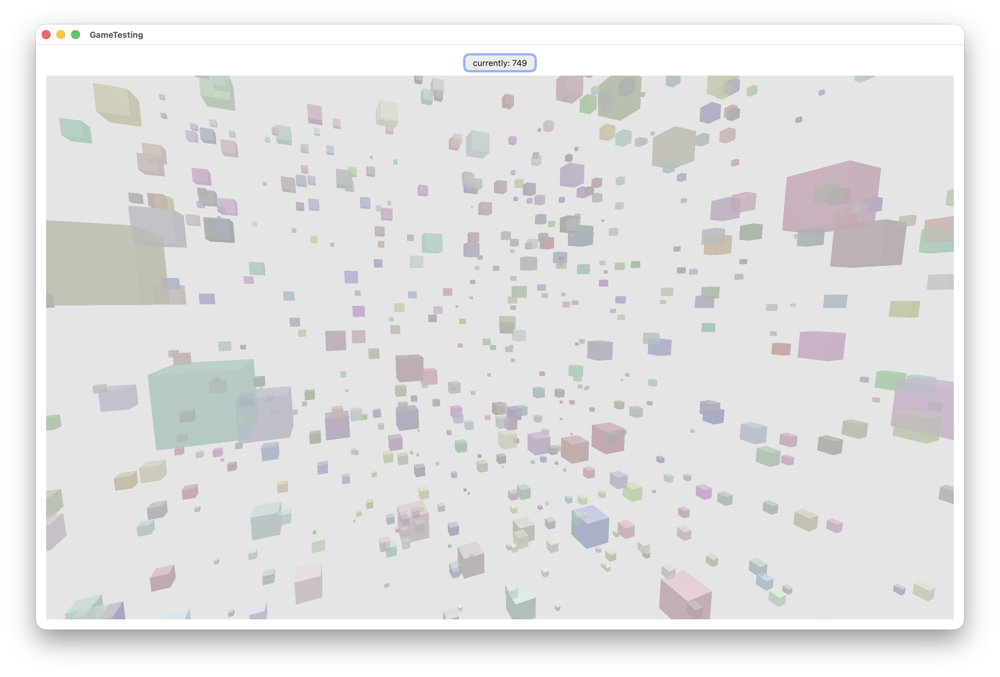

# Renderer3D

this is a simple library to render 3D scene in a SwiftUI widget using metal

```swift
import Render3DViews
import SwiftUI

struct ContentView: View {
	let scene = Scene3D()
	@State var camera = OrbitingCameraState()
	@State var cnt = 10000
	private func setScene() {
		cnt = Int.random(in: 5...1_000)
		let range = log10(Float(cnt)) * 40
        let points = (1...cnt).map({ _ in
            let color = Vec4.random(in: 0.8...1)
            return Primitive.Cube(
                center: Vec3.random(in: -range...range), size: Float.random(in: 1...5),
                color: color)
        })

		scene.draw({ ctx in
			ctx.draw(points)
		})
	}
	var body: some View {
		VStack {
			Button("currently: \(cnt)") {
				setScene()
			}

			OrbitingSceneView(scene: scene, cameraState: $camera)
		}.onAppear { setScene() }.padding()

	}
}
```

